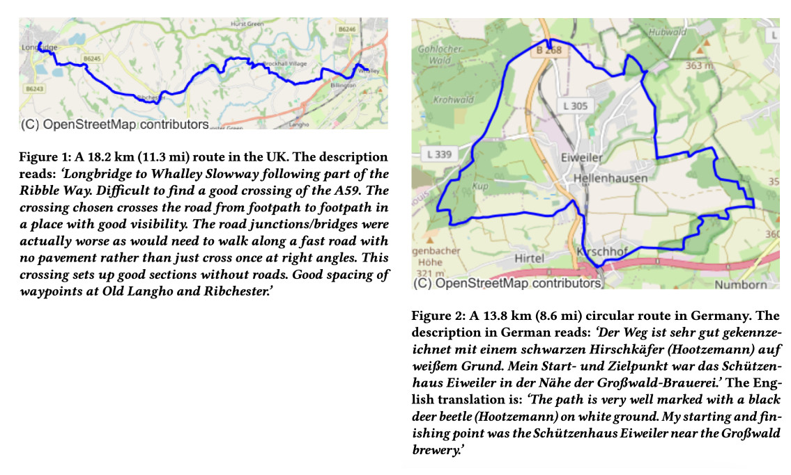

# CC-GPX: Extracting High-Quality Annotated Geospatial Data from Common Crawl 

📜 This is the official code repository for the pre-print titled 'CC-GPX: Extracting High-Quality Annotated Geospatial Data from Common Crawl' and published on arXiv: https://arxiv.org/abs/2405.11039

**Authors:** [Ilya Ilyankou](https://ilyankou.com), Dr James Haworth and Dr Stefano Cavazzi

## Abstract
The Common Crawl (CC) corpus is the largest open web crawl dataset containing 9.5+ petabytes of data captured since 2008. The dataset is instrumental in training large language models, and as such it has been studied for (un)desirable content, and distilled for smaller, domain-specific datasets. However, to our knowledge, no research has been dedicated to using CC as a source of annotated geospatial data. In this paper, we introduce an efficient pipeline to extract annotated user-generated tracks from GPX files found in CC, and the resulting multimodal dataset with 1,416 pairings of human-written descriptions and MultiLineString vector data. The dataset can be used to study people's outdoor activity patterns, the way people talk about their outdoor experiences, and for developing trajectory generation or track annotation models.



## Setup

We recommend running the notebooks in a separate virtual environment. Using [`conda`](https://docs.conda.io/projects/conda/en/stable/user-guide/install/index.html),

```shell
# Navigate to the project folder
cd cc-gpx

# Create a new virtual environment
conda env create -f environment.yml

# Activate that new virtual environment
conda activate cc-gpx

# Run Jupyter (will open in your default browser)
jupyter lab
```

## Dataset

Run the notebooks in order to build the final GeoPackage dataset with the following fields:

|#|Property|Description|
|--|--|--|
1 | url | URL of the GPX file
2 | warc_file | CC WARC file with GPX file
3 | warc_offset | GPX file position in WARC
4 | warc_len | GPX file byte length
5 | country | Country name as determined by the first point in the track intersecting [geoBoundaries](https://www.geoboundaries.org/)
6 | desc | Original track description
7 | desc_lang | Track description language code, as determined by [pycld2](https://github.com/aboSamoor/pycld2)
8 | desc_en | Track description translated into English
9 | elev_source | GPS if elevation is recorded by device; DEM if determined later from Shuttle Radar Topography Mission
10 | elev_highest | Track’s highest point, m
11 | elev_lowest | Track’s lowest point, m
12 | uphill | Cumulative elevation gain, m
13 | downhill | Cumulative elevation loss, m
14 | length_2d | Track length disregarding elevation, m
15 | length_3d | Track length accounting for elevation, m
16 | is_circular | *True* if start and end points are within 350 m from each other, *False* otherwise
17 | geometry | MultiLineString Z geometry in GPS coordinates: (lat, lon, elevation)


## Cite

If you find this dataset or workflow useful for your research, please cite us!
```
@misc{ilyankou2024ccgpx,
      title={CC-GPX: Extracting High-Quality Annotated Geospatial Data from Common Crawl}, 
      author={Ilya Ilyankou and James Haworth and Stefano Cavazzi},
      year={2024},
      eprint={2405.11039},
      archivePrefix={arXiv},
      primaryClass={cs.CL}
}
```